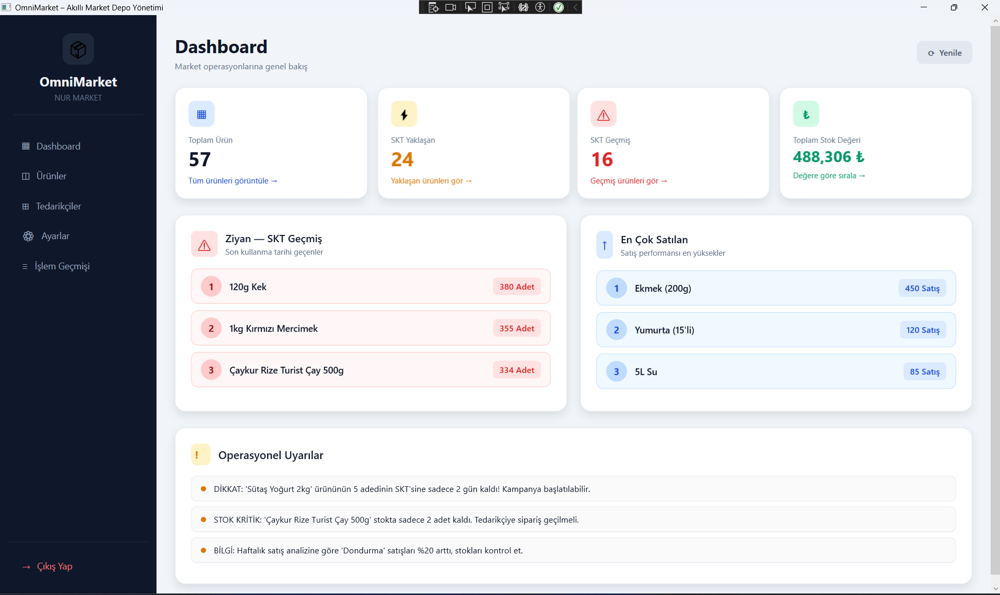
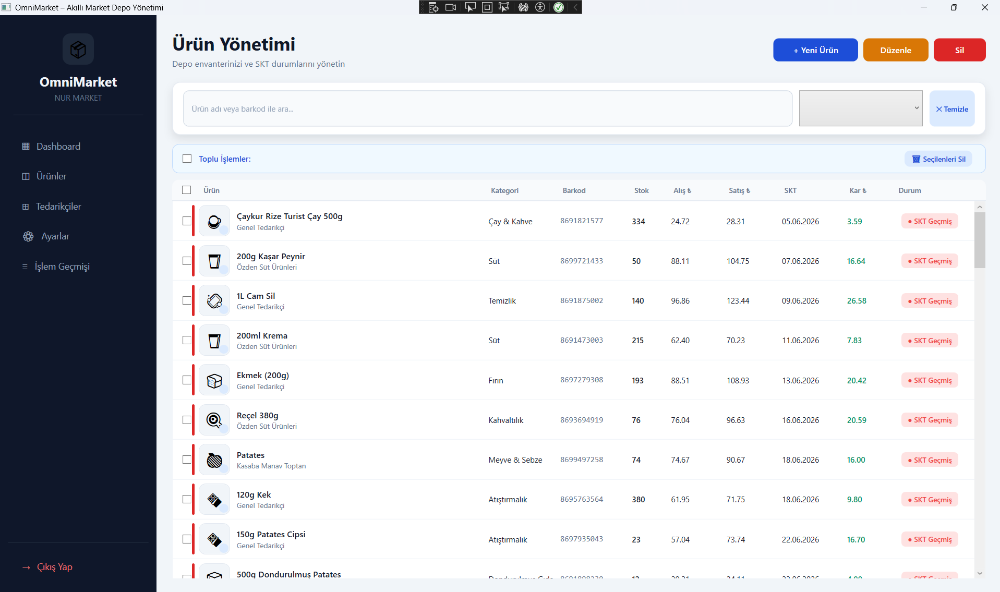
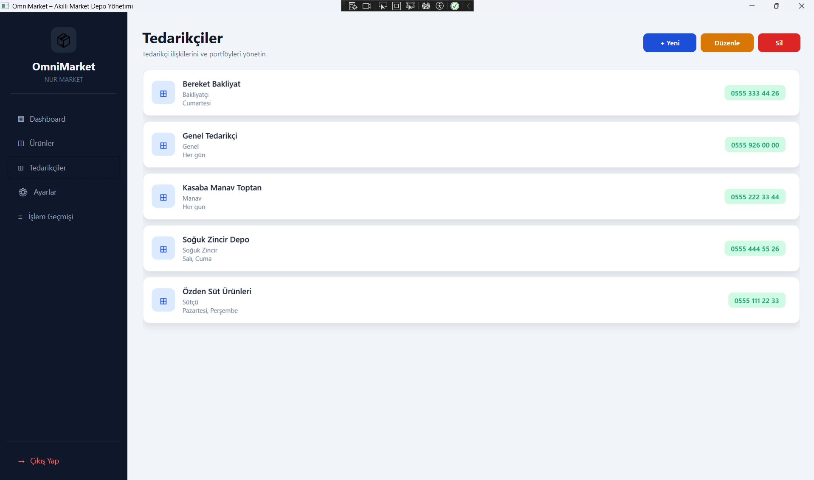
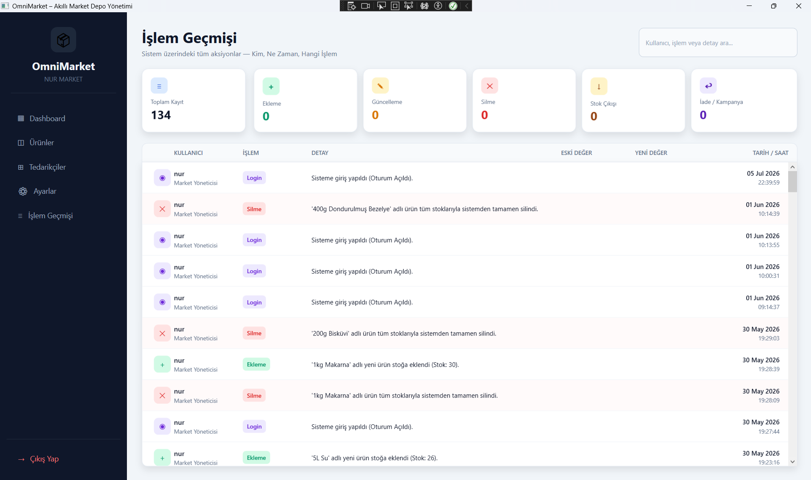

# OMNİMARKET

**OmniMarket**, işletmenizin tedarik zinciri, ürün yönetimi ve operasyonel süreçlerini tek bir merkezden, kolayca yönetmenizi sağlayan **.NET 9** tabanlı güçlü bir WPF masaüstü uygulamasıdır. MVVM (Model-View-ViewModel) mimarisiyle geliştirilmiş olan proje, esnek yapısı ve modern arayüzü ile kullanıcılarına eşsiz bir deneyim sunmayı hedefler.

---

## ✨ Öne Çıkan Özellikler

- 📊 **Kapsamlı Dashboard:** Satışlarınızı, stok durumunuzu ve genel şirket analizlerinizi anlık olarak izleyebileceğiniz modern gösterge paneli.
- 📦 **Ürün Yönetimi:** Detaylı ürün listeleme, stok takibi, yeni ürün ekleme ve ürün bilgilerini hızlıca güncelleme.
- 🤝 **Tedarikçi (Supplier) Entegrasyonu:** Tedarikçi listeleme, detay görüntüleme ve tedarik süreçlerinin takibi.
- 🔒 **Kullanıcı İşlemleri:** Güvenli Login & Register sistemi ile yetkilendirme altyapısı.
- ⚙️ **Dinamik Ayarlar (Settings):** Sisteminizi işletmenize göre kalibre edip özelleştirin.
- 📝 **Log Takibi:** Sistem içerisinde yapılan her hareketin kayıt altına alındığı güvenli log sistemi.

---

## 🛠️ Kullanılan Teknolojiler

- **Platform:** [.NET 9](https://dotnet.microsoft.com/)
- **UI Framework:** WPF (Windows Presentation Foundation)
- **Mimari:** MVVM (Model-View-ViewModel)
- **Dil:** C#

---

## 🚀 Başlarken

Projeyi kendi bilgisayarınızda çalıştırmak için aşağıdaki adımları izleyebilirsiniz.

### Önkoşullar
- **[Visual Studio 2022](https://visualstudio.microsoft.com/)** (WPF geliştirme iş yükü seçili olmalı)
- **[.NET 9 SDK](https://dotnet.microsoft.com/download/dotnet/9.0)**

### Kurulum

1. Projeyi bilgisayarınıza klonlayın:
   ```bash
   git clone https://github.com/nurdanozden/OmniMarket.git
   ```
2. Çözüm (`.sln`) dosyasını **Visual Studio 2022** ile açın.
3. Projeyi derleyin (**Build Solution**). Gerekli Nuget paketleri otomatik olarak geri yüklenecektir.
4. Başlat tuşuna basarak veya `F5` kullanarak uygulamayı çalıştırın.

---

## 📸 Ekran Görüntüleri

*(Projenize ait ilgi çekici ekran görüntülerini bu bölüme ekleyebilirsiniz)*


 




---


## 📜 Lisans

Bu proje [MIT Lisansı](LICENSE) altında lisanslanmıştır. Daha fazla bilgi için `LICENSE` dosyasını inceleyebilirsiniz.

---
<div align="center">
  <b>Geliştirici İle İletişime Geçin</b><br>
  Coded with 💖 by Nurdan Özden
</div>
